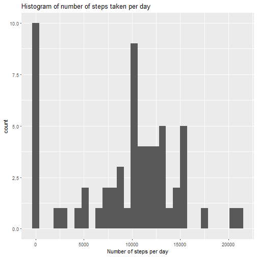
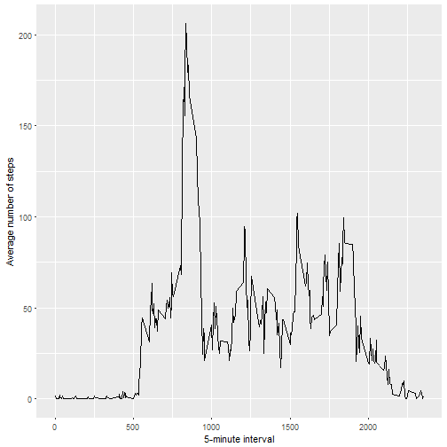
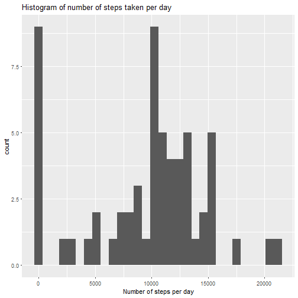
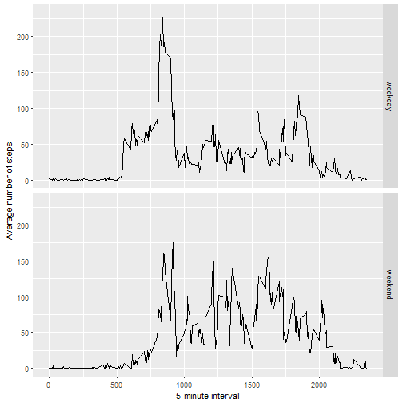

```r
library(lubridate)
library(dplyr)
library(ggplot2)
```

## Loading and preprocessing the data


```r
unzip('activity.zip',files=c('activity.csv'))
activity_data <- read.csv('activity.csv')
activity_data$date <- ymd(as.character(activity_data$date))
```

## What is mean total number of steps taken per day?


```r
activity_data_steps_per_day <- activity_data %>% group_by(date) %>% summarise(steps_per_day=sum(steps,na.rm=TRUE))
qplot(steps_per_day,data=activity_data_steps_per_day,geom="histogram",xlab="Number of steps per day",main="Histogram of number of steps taken per day")
```

```
## `stat_bin()` using `bins = 30`. Pick better value with `binwidth`.
```



Mean of the total number of steps taken per day:


```r
mean(activity_data_steps_per_day$steps_per_day)
```

```
## [1] 9354.23
```

Median of the total number of steps taken per day:


```r
median(activity_data_steps_per_day$steps_per_day)
```

```
## [1] 10395
```

## What is the average daily activity pattern?


```r
activity_data_steps_per_5m_interval <- activity_data %>% group_by(interval) %>% summarise(steps_per_interval=mean(steps,na.rm=TRUE))
qplot(interval,steps_per_interval,data=activity_data_steps_per_5m_interval,geom="line",xlab="5-minute interval",ylab="Average number of steps")
```



Which 5-minute interval, on average across all the days in the dataset, contains the maximum number of steps?


```r
activity_data_steps_per_5m_interval[with(activity_data_steps_per_5m_interval, which(steps_per_interval==max(steps_per_interval,na.rm=TRUE))),]$interval
```

```
## [1] 835
```

## Imputing missing values

Total number of missing values in the dataset (i.e. the total number of rows with NAs):


```r
sum(is.na(activity_data$steps))
```

```
## [1] 2304
```

Creating a new dataset that is equal to the original dataset but with the missing data filled in ...


```r
activity_data_without_na <- activity_data
activity_data_without_na$steps <- ifelse(is.na(activity_data_without_na$steps),subset(activity_data_steps_per_5m_interval,interval==activity_data_without_na$interval)$steps_per_interval,activity_data_without_na$steps)
```

Making a histogram of the total number of steps taken each day ...


```r
activity_data_without_na_steps_per_day <- activity_data_without_na %>% group_by(date) %>% summarise(steps_per_day=sum(steps,na.rm=TRUE))
qplot(steps_per_day,data=activity_data_without_na_steps_per_day,geom="histogram",xlab="Number of steps per day",main="Histogram of number of steps taken per day")
```

```
## `stat_bin()` using `bins = 30`. Pick better value with `binwidth`.
```



Mean total number of steps taken per day:


```r
mean(activity_data_without_na_steps_per_day$steps_per_day)
```

```
## [1] 9530.724
```

Median total number of steps taken per day:


```r
median(activity_data_without_na_steps_per_day$steps_per_day)
```

```
## [1] 10439
```

## Are there differences in activity patterns between weekdays and weekends?

Creating a new factor variable in the dataset with two levels – “weekday” and “weekend” indicating whether a given date is a weekday or weekend day.


```r
activity_data_without_na$dayfactor <- factor(ifelse(weekdays(activity_data_without_na$date) %in% c("ñóáîòà","íåä³ëÿ"),"weekend","weekday"))
```

Making a panel plot containing a time series plot (i.e. type = "l") of the 5-minute interval (x-axis) and the average number of steps taken, averaged across all weekday days or weekend days (y-axis).


```r
activity_data_without_na_steps_per_5m_interval <- activity_data_without_na %>% group_by(interval,dayfactor) %>% summarise(steps_per_interval=mean(steps,na.rm=TRUE))
qplot(interval,steps_per_interval,data=activity_data_without_na_steps_per_5m_interval,geom="line",facets=dayfactor~.,xlab="5-minute interval",ylab="Average number of steps")
```


